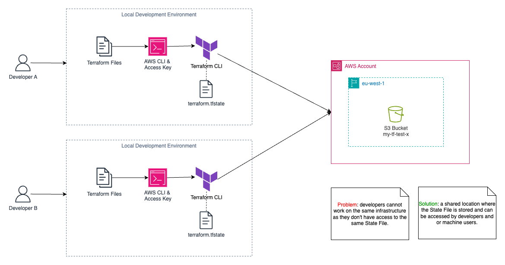
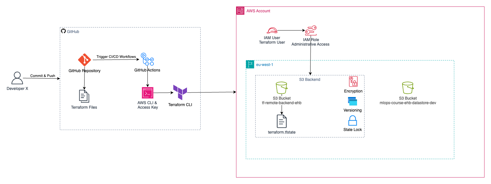

# AWS Infrastructure Setup with Terraform and GitHub Actions

Now that you've provisioned infrastructure resources using Terraform locally, it's time to prepare for real-world collaboration and automation. At maturity level 0, each developer works in isolation, managing their own Terraform state file locally. 

Problem: 
- Collaboration is hard, changes conflict, and there’s a risk of accidental resource changes. 


Solution:
- Use a remote backend for shared Terraform state.
- Manage cloud resources with a dedicated machine user for automation.
- Automate provisioning via GitHub Actions, making infrastructure changes repeatable, auditable, and safe.


## Prerequisites

* [Terraform](https://developer.hashicorp.com/terraform/downloads)
* [AWS CLI](https://aws.amazon.com/cli/)
* [GitHub](https://docs.github.com/en/get-started/start-your-journey/creating-an-account-on-github)

## 1. Setup Terraform Remote Backend
Before we setup the remote backend for the Terraform state file so that everyone works with the same infrastructure state and have features such as:
- State Locking - prevents concurrent changes
- Versioning - rollback to earlier state if needed
- Encryption - sensitive data in state file is encrypted

We first need to avoid the chicken or the egg problem by provisioning an S3 Bucket to store our Terraform state file. Feel free to use AWS Console (UI), AWS SDKs or CLI. While we're at it we will provision the IAM user (Terraform machine user to be used for automation with GitHub Actions) as well.
```bash
AWS CLI
-------

# Specify the username for the new IAM user
USER_NAME="terraform_user"

# Create IAM User and capture the response
USER_RESPONSE=$(aws iam create-user --user-name "$USER_NAME")

# Check the Amazon Resource Name (ARN) from create-user response.
echo $USER_RESPONSE                                          

# Attach Admin Access Policy to IAM User
aws iam attach-user-policy --user-name "$USER_NAME" --policy-arn arn:aws:iam::aws:policy/AdministratorAccess

# Create Access and Secret Access Keys
CREDS_JSON=$(aws iam create-access-key --user-name "$USER_NAME")

# Check Access and Secret Access Keys from create-access-key response.
echo $CREDS_JSON                                          

# Create S3 Bucket
S3_BUCKET_NAME="tf-remote-backend-ehb"
aws s3 mb "s3://$S3_BUCKET_NAME" --region "eu-west-1"

# Enable Versioning for S3 Bucket
aws s3api put-bucket-versioning --bucket "$S3_BUCKET_NAME" --versioning-configuration Status=Enabled
```
## 2. Improve Project Structure
Organize your infrastructure code for clarity and scalability:
```
mlops-course-02  
├── assets/  
├── docs/  
├── src/  
├── terraform/  
│   ├── backends/  
│   │   ├── dev.conf  
│   │   ├── prd.conf  
│   │   └── tst.conf  
│   ├── environments/  
│   │   ├── dev.tfvars  
│   │   ├── prd.tfvars  
│   │   └── tst.tfvars  
│   ├── modules/  
│   │   └── s3-bucket/  
│   │       ├── locals.tf  
│   │       ├── main.tf  
│   │       ├── outputs.tf  
│   │       ├── variables.tf  
│   │       └── README.md  
│   ├── provider.tf  
│   ├── s3_buckets.tf  
│   └── variables.tf  
├── README.md
```
All Terraform files live under the `terraform/` folder
- Modularization: The new structure introduces Terraform `modules` for reusable, scalable infrastructure components.
- Multiple Environment Support: Separate `environments/dev.tfvars` and `backends/dev.conf` for environment-specific configuration.
- Variable Management: Centralized in `variables.tf`.

## 3. Terraform Configuration
Uses variables for AWS region `var.aws_region` to allow for different environments.
Configures a remote backend `backend "s3" {}` so state is managed in S3, not locally.

`provider.tf`
```hcl
terraform {
  required_providers {
    aws = {
      source  = "hashicorp/aws"
      version = ">=5.97"
    }
  }
  
  backend "s3" {}
}

provider "aws" {
  region = var.aws_region
}
```

Each environment has its own backend configuration file, parameterizing the S3 bucket, state file key, and region.

`backends/{env}.conf`
```terraform
bucket  = "terraform-backends-ehb"
key     = "terraform-{env}.tfstate"
region  = "eu-west-1"
```
All environment-specific or customizable settings (like region, environment, resource delimiter, and S3 buckets) are defined as variables.

`variables.tf`
```hcl
variable "aws_region" {
  description = "AWS region"
  default     = "eu-west-1"
}

variable "environment" {
  description = "Specifies the deployment environment of the resources (e.g., sandbox, dev, tst, acc, prd)"
  type        = string
  default     = "sandbox"
}

variable "delimiter" {
  description = "Resource name delimiter"
  type        = string
  default     = "-"
}

variable "s3_buckets" {
  description = "A list of S3 Buckets"
  type        = list(any)
  default     = []
}
```

Uses a module to define S3 buckets, leveraging the for_each construct to dynamically create as many buckets as you need, with consistent naming and tagging.

`s3_buckets.tf`
```hcl
module "s3_bucket" {
  for_each = { for s3 in var.s3_buckets : s3.key => s3 }
  source   = "./modules/s3-bucket"

  bucket = join(var.delimiter, [each.value.key, var.environment])
  tags   = merge(try(each.value.tags, {}), { environment = var.environment })
}
```

All variable values specific to an environment. Easy switching between dev, test, and prod by changing which tfvars file you use.

`environments/{env}.tfvars`
```hcl
environment = "dev"
location    = "eu-west-1"


s3 = [
  {
    key  = "mlops-course-ehb-datastore"
    tags = {}
  }
]
```

### 4. Automate with GitHub Actions (CI/CD)
To integrate and automate your Git repository with a CI/CD pipeline for managing infrastucture and other artifacts, you'll typically use service like GitHub Actions, GitLab CI/CD, or Jenkins. Here we will use GitHub Actions.

**Set Up Your AWS Credentials**

1. Create AWS IAM User: In AWS IAM, create a new user with programmatic access and assign appropriate permissions. Store the AWS Access Key ID and Secret Access Key. You’ll need these for your CI/CD pipeline. (already done using AWS CLI)

2. Use Environment Variables: The recommended way to provide AWS credentials to Terraform is through environment variables. Set AWS_ACCESS_KEY_ID and AWS_SECRET_ACCESS_KEY as environment variables in your CI/CD pipeline settings.

3. GitHub Secrets:
- Store your AWS Access Key and Secret Key in GitHub Secrets. GitHub Secrets provide a secure way to store and manage sensitive information in your GitHub repository.
- In your GitHub repository, go to Settings > Secrets and variables > Actions > Repository secrets and add your AWS credentials as secrets.

**Prepare Your GitHub Repository**

1. Create or Use an Existing Repository: If you haven’t already, create a new GitHub repository or use an existing one for your Terraform code.
2. Push Your Terraform Code: Ensure your Terraform code (.tf files) is in the repository.


**Create GitHub Actions Workflow**

1. Create Workflow Directory: In your repository, create a directory named .github/workflows if it doesn’t already exist.
2. Add Workflow File: Create a new YAML file in the workflows directory (e.g., tf-infra-cicd-dev.yml).
Define Workflow Steps: Edit the YAML file to define the CI/CD steps. Here’s an example:

```YAML
name: tf-infra-cicd-dev

# Controls when the workflow will run
on:
  # Triggers the workflow on push or pull request events but only for the "main" branch
  pull_request:
    branches: [ "main" ]

  # Allows you to run this workflow manually from the Actions tab
  workflow_dispatch:

jobs:
  terraform-validate-plan-apply:
    runs-on: ubuntu-latest
    defaults:
      run:
        working-directory: mlops-course-02/terraform

    steps:
      - name: Checkout repository
        uses: actions/checkout@v4

      - name: Setup Terraform
        uses: hashicorp/setup-terraform@v3

      - name: Configure AWS credentials
        uses: aws-actions/configure-aws-credentials@v4
        with:
          aws-access-key-id: ${{ secrets.AWS_ACCESS_KEY_ID }}
          aws-secret-access-key: ${{ secrets.AWS_SECRET_ACCESS_KEY }}
          aws-region: eu-west-1

      - name: Terraform Format
        run: terraform fmt -check
        continue-on-error: true

      - name: Terraform Init
        run: terraform init --backend-config='backends/dev.conf'

      - name: Terraform Validate
        run: terraform validate -no-color

      - name: Terraform Plan
        run: terraform plan -no-color --var-file='environments/dev.tfvars'

      - name: Terraform Apply
        run: terraform apply --var-file='environments/dev.tfvars' -auto-approve
```

**Push Workflow File to GitHub**

1. Commit the Workflow File: Add the .github/workflows/tf-infra-cicd-dev.yml file to your repository, commit, and push it to GitHub.
```bash
git add .github/workflows/tf-infra-cicd-dev.yml
git commit -m "Add Terraform CI/CD workflow"
git push origin main
```
Verify Actions: Go to the ‘Actions’ tab in your GitHub repository to see the CI/CD pipeline in action after the push.
